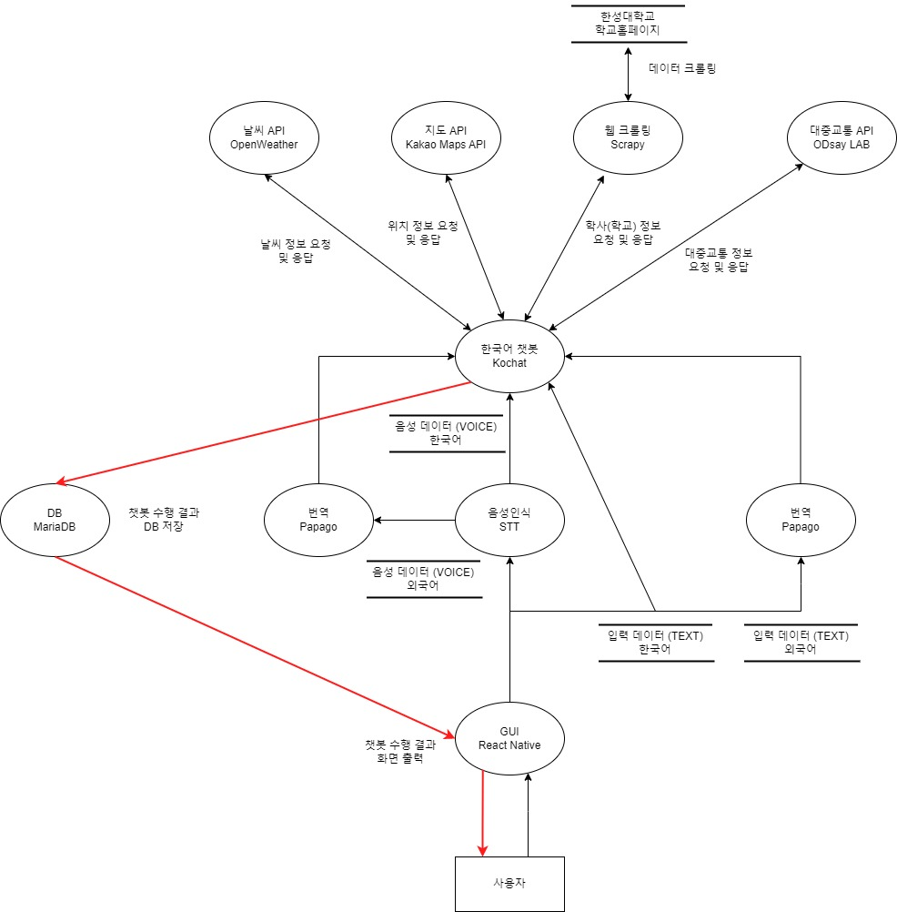

 

# 시스템 설계서

## 1.서비스

### 1-1. 개요

한성대 학생을 위한 통합 챗봇 서비스

### 1-2. 서비스 소개

학교 생활에 도움이 되는 여러 기능을 제공받을 수 있는 챗봇 서비스이다.

학교식당 메뉴, 교통정보, 날씨정보를 제공하고, 모든 기능에는 오픈소스가 활용되었다.

추가로 음성입력, 번역 기능을 제공함으로 이용 대상과 편의성을 확장시켰다.

##  2. 유사 서비스

https://medium.com/naver-cloud-platform/%EA%B0%84%EB%8B%A8-%EC%B1%97%EB%B4%87-%EB%A7%8C%EB%93%A4%EA%B8%B0-%EC%B1%97%EB%B4%87-%EC%84%9C%EB%B9%84%EC%8A%A4%EB%A5%BC-%EA%B8%B0%ED%9A%8D%ED%95%A0-%EB%95%8C-%EB%B0%98%EB%93%9C%EC%8B%9C-%EA%B3%A0%EB%A0%A4%ED%95%B4%EC%95%BC-%ED%95%98%EB%8A%94-4%EA%B0%80%EC%A7%80-70d66108e434

##  3. 오픈소스 소프트웨어

##  3-1. __React Native__
## React Native
React Native는 페이브북이 개발한 오픈 소스 모바일 애플리케이션 프레임워크이다.
## React Native 선정 이유
React Native는 React의 선언형 UI 프레임워크를 iOS 및 Android에 제공한다. React Native를 사용하면 기본 UI 컨트롤을 사용하고 기본 플랫폼에 대한 전체 액세스 권한을 갖는다.
## React Native의 특징
* React를 사용하면 대화형 UI를 쉽게 만들 수 있다. 선언적 보기를 사용하면 코드를 더 쉽게 예측할 수 있고 디버깅 할 수 있다. 
* 자바스크립트에 대한 변경사항은 네이티브 앱을 재구축하지 않고도 라이브로 로드할 수 있다.
* 상태를 관리하는 캡슐화된 구성 요소를 만든 다음 복잡한 UI를 만들도록 구성합니다. 
* iOS, Android 및 기타 플랫폼에서 코드를 재사용할 수 있다.

## 라이센스
MIT License

##  3-2. __KoChat__
## 박수훈
## Kochat이란?

Kochat은 한국어 전용 오픈소스 목적지향 챗봇 프레임워크이다.  
목적지향 챗봇은 일정 관리, 호텔/식당/항공권 등의 예약, 음악 듣기 등 명령 전달, 콜센터 상담 등과 같은 특정된 목적을 달성하기 위해 사용되는 챗봇을 말한다.

## Kochat을 선정한 이유

초보자가 연구자들의 소스코드를 활용하여 챗봇을 만들 때, 각각의 모듈을 구현하는 것은 어려우며, 이러한 모듈을 연결하여 파이프라인을 형성하는 것도 많은 전문성을 요한다. 따라서 이들이 목적지향 챗봇을 구현할 때는 직접 모든 모듈을 구현하기보다는 챗봇 빌더나 오픈소스 프레임워크를 활용하는 것이 일반적이다.  
이 중 챗봇 빌더의 경우, 대부분 과금 정책을 적용하고 있기 때문에 무료로 목적지향 챗봇을 개발하려면 오픈소스 프레임워크를 이용해야 한다. 현재까지 몇몇 오픈소스가 출시되었지만 주로 영어를 위주로 개발되어 왔고, 한국어를 처리하기 위해서는 복잡한 과정을 거쳐야만 한다.  
Kochat은 오픈소스 챗봇 개발 프레임워크이기 때문에 머신러닝 개발자라면 누구나 무료로 한국어 챗봇을 개발할 수 있다.   또한 Kochat은 일반인을 타깃으로한 챗봇빌더보다는 개발자를 타깃으로한 프레임워크로 프레임워크에 본인만의 모델을 추가할 수 있고, Loss 함수를 바꾸거나 새로운 기능을 첨가할 수 있다.  
이에 따라, 한국어 전용 목적지향 챗봇 프레임워크인 Kochat을 사용하게 되었다.

## Kochat 프레임워크에 대해

Kochat 은 데이터세트, 임베딩, 인텐트, 폴백, 엔티티, 슬롯필링+API, 시각화 등의 모듈로 구성된다.

- 데이터 세트 모듈  
  사용자의 입력 데이터를 전처리하기 위한 모듈이다. 사용자로부터 문장이 입력되면 네이버 맞춤 검사기를 이용하여 오탈자를 교정한 뒤, 품사를 기반으로 토큰화를 진행한다.
- 임베딩 모듈  
  데이터 전처리 이후에 임베딩 모듈을 통해 워드 임베딩을 수행한다.
- 인텐트 모듈  
  사용자 발화의 의도를 파악하기 위해 사용된다.
- 폴백 모듈  
  정해진 도메인 이외의 문장이 입력된 경우, “잘 모르겠어요.”와 같은 문장을 반환하여 대화가 지정된 도메인 안에서 진행되게 유도한다.
- 엔티티 모듈  
  문장 내에 존재하는 개체명을 인식하기 위해 사용된다. 예를 들어 “수요일 부산 날씨 어때?”라는 문장이 주어지면, ‘수요일’을 날짜(DATE)로, ‘부산’을 장소(LOCATION)로 인식한다.
- 슬롯필링 + API 모듈  
  슬롯필링은 목적지향 챗봇 구현시 주로 이용되는 기법이다. 먼저 인텐트 모듈을 통해 슬롯을 고르고, 엔티티 모듈을 통해 해당 슬롯을 채운다. 마지막으로 API 를 호출하여 사용자에게 정보를 제공할 수 있다. 예를 들어, 사용자가 “수요일 부산 날씨 어때?”라는 문장을 입력하면 인텐트 모듈은 이 문장을 날씨에 관련된 문장으로 분류하여 여러 슬롯 중, 날씨 API 를 호출하기 위한 슬롯을 선택한다.
- 시각화 모듈  
  사용자는 별도의 설정 없이 여러가지 시각화 자료를 제공받을 수 있다.
- 사용자 인터페이스
  사용자는 아래와 같이 사용하기 쉬운 인터페이스를 통해 자신만의 챗봇을 구축할 수 있다.

  출처: 고현웅 외 2명. (2021). Kochat: 한국어 목적지향 챗봇 프레임워크. ACK 2021 학술발표회 논문집, 28(2), pp. 596-599.

> 오픈소스 소스코드와 문서: https://github.com/hyunwoongko/kochat

    Copyright 2020 Hyunwoong Ko.
    
    Licensed under the Apache License, Version 2.0 (the "License");
    you may not use this file except in compliance with the License.
    You may obtain a copy of the License at
    
    http://www.apache.org/licenses/LICENSE-2.0
    
    Unless required by applicable law or agreed to in writing, software
    distributed under the License is distributed on an "AS IS" BASIS,
    WITHOUT WARRANTIES OR CONDITIONS OF ANY KIND, either express or implied.
    See the License for the specific language governing permissions and
    limitations under the License.

##  3-3. __Kospeech(STT)__
## 박태범

## STT 오픈소스 링크

https://github.com/sooftware/kospeech

## STT란?

음성인식(Speech Recognition)이란 사람이 말하는 음성 언어를 컴퓨터가 해석해 그 내용을 문자데이터로 전환하는 처리를 말하며 STT(Speech-to-Text)라고도 한다.

## STT 핵심 요소 기술

STT를 위한 데이터에는 크게 음향학적 관점과 언어학점 관점으로 볼 수 있다. 음향학점 관점은 말하는 이, 공간, 노이즈 등의 환경적인 데이터가 주를 이루고 언어학적 관점에서는 어휘, 문맥, 문법 등을 모델링하기 위한 언어 데이터가 주를 이룬다.

STT는 크게 음성/언어 데이터로부터 인식 네트워크 모델을 생성하는 오프라인 학습 단계와 사용자가 발성한 음성을 인식하는 온라인 탐색 단계로 나뉜다. STT 엔진은 음성과 언어 데이터의 사전 지식을 사용해서 음성 신호로부터 문자 정보를 출력하는데 이 때 해석이라는 차원에서 STT 알고리즘을 디코더(Decoder)라고도 부른다. 디코딩 단계에서는 학습 단계 결과인 음향 모델(Acoustic Model), 언어 모델(Language Model)과 발음 사전(Pronunciation Lexicon)을 이용하여 입력된 특징 벡터를 모델과 비교, 스코어링(Scoring)하여 단어 열을 최종 결정 짓는다.

음향 모델링은 해당 언어의 음운 환경별 발음의 음향적 특성을 확률 모델로 대표 패턴을 생성하는 과정이고, 언어모델링은 어휘 선택, 문장 단위 구문 구조 등 해당 언어의 사용성 문제에 대해 문법 체계를 통계적으로 학습하는 과정이다. 또한 발음 사전 구축을 위해서는 텍스트를 소리 나는 대로 변환하는 음소 변환(Grapheme-to-Phoneme) 구현 과정이 필요하며, 표준 발음을 대상으로 하는 발음 변환 규칙만으로는 방언이나 사용자의 발화 습관과 어투에 따른 다양한 패턴을 반영하기 어려운 경우가 있어 별도의 사전 구축이 필요하게 된다.

## STT의 성능

기존에 상용 서비스에 적용되는 음향 모델의 대부분은 확률 통계 방식인 HMM(Hidden Markov Model) 기반으로 이루어졌으며, 2010년대 들어서면서 딥러닝 기반으로 HMM/DNN 방식으로 단어 인식 오류를 개선하여 20% 성능 향상을 이루어 냈다.

최근에는 시퀀스-투-시퀀스(Sequence-to-Sequence) 방식의 RNN 기반으로 속도와 성능 면에서 좋은 결과를 가져오면서, 음성 인식에서도 번역어(End-to-End) 학습 방식의 발전으로 일련의 오디오 특징을 입력으로 일련의 글자(character) 또는 단어들을 출력으로 하는 단일 함수를 학습할 수 있게 되었다. 또한 CTC(Connectionist Temporal Classification) 이라는 모델로 입력 데이터와 레이블 사이의 음성 정렬(alignment) 정보가 없어도 학습이 가능하게 되었다. 이와 같은 다양한 학습법을 통해 계속해서 STT의 성능은 향상되고 있다.

## 활용분야

어학원 및 어학 컨텐츠: 외국어 교육 학원 및 컨텐츠 업체에 음성인식을 적용하여 발음 정확도 향상

네비게이션: 네비게이션의 목적지 검색 및 설정 시 음성으로 입력하는 기능

홈쇼핑: 자동 주문 시 물품 수령 주소에 대한 음성인식

채팅 서비스: 사용자의 음성을 인식하여 자동으로 채팅창에 입력하는 기능

## STT 오픈소스 중 Kospeech 모델 선정 이유

1. 한국어 음성으로 구현된 STT 모델이 있는지 여부를 고려했는데, 대부분 오픈소스 STT 모델들은 그 성능이 영어에 한정해서 알려져 있었기 때문에, 한국어 음성에 대해서도 검증된 사례가 있는 Kospeech를 선정했다

2. Kospeech는 2020년 김수환이라는 개발자가 공개한 한국어 음성인식 모델을 제공하는 오픈소스 툴킷이다. Kospeech의 모델들은 End-to-End 방식을 따르는데, 여기서 End-to-End는 음성 데이터가 포함하는 문법, 발음 등의 특징까지 모두 모델이 학습하도록 하는 방식을 말한다. 따라서 Raw audio를 통째로 input으로 넣어주는 것이 특징이다.

## 라이선스

Apache-2.0 라이선스

##  3-4. MariaDB
## MariaDB
MariaDB는 오픈소스 관계형 데이터베이스 관리 시스템이다.
## MariaDB 소개
MariaDB는 MySQL이 오라클에 인수되면서 핵심 개발자들과 의견 차이가 생기게 되면서, 일부 개발자들이 회사를 떠나 새로운 오픈소스 데이터베이스 관리 시스템을 개발하면서 생겨났다.  
MariaDB의 초창기 버전인 MariaDB 5.5은 MySQL 5.5 버전을 기반으로 개발했기 때문에 MySQL의 거의 모든 기능과 호환이 가능하다.
## MariaDB 특징
* MariaDB는 MySQL과 동일한 소스 코드를 기반으로 하기 때문에 MySQL과 높은 호환성을 유지한다.
* MySQL과 비교해 애플리케이션 부분 속도가 4~5천배 정도 빠르며, 성능 면에서는 최고 70%의 향상을 보인다. 
## 라이센스
MariaDB 서버: GPL 2.0  
MariaDB 커넥터/클라이언트: LGPL

##  3-5. OpenWeather
## 이찬우

###  :sunny: **찾은 Open-source Link** : https://openweathermap.org/api

###  :ledger: **오픈소스 이름** : OpenWeather (전 세계 날씨 정보를 알려주는 통합 API)

###  :question: **오픈소스 선정이유** : 해당 API는 전 세계의 개발자들이 활용하여 정확도가 높다고 판단해 선정했습니다.

###  :open_mouth: **해당 오픈소스 특징** :  

- JSON 형태로 다양한 언어를 활용해 서비스를 제작할 수 있다.

- 국가, 도시명으로 분류하는 것이 아닌 위도와 경도의 수치로 해당 위치에 대한 정보를 주어 특정 위치의 데이터를 얻기가 수월하다.
- 다양한 개발자의 커스텀된 자료와 융합을 할 수 있다.
- 온도뿐만이 아닌 미세먼지 정보도 호출할 수 있다.

###  🔧 **해당 오픈소스 기능** : Free Plan 기준으로 작성 

- 현재 날씨 데이터
- 날씨 예보 (5일 동안)
- 기본 날씨 지도
- 날씨 대시보드
- 대기오염 API
- 지오코딩 API (지리적 위치와 좌표로 검색)
- 날씨 위젯

###  :bulb: **오픈소스 활용 방안** :

1. 현 거주지의 날씨 정보 및 학교 주변의 날씨, 대기오염을 알려주어  
   등하교 시의 날씨로 인한 불편함을 없게 한다.
2. 날씨 위젯을 활용하여서 한 눈에 날씨 정보를 알 수 있도록 한다.
     

### 📝 **라이선스** : **ODbL** (Open Database License)

Free와 Startup plan에 한 함.  

### **API를 이용한 Demo Web Page**

...

##  3-6. __Scrapy__
## 주권영

#### 1. 오픈소스 링크

https://github.com/scrapy/scrapy

#### 2. Scrapy란?

웹 데이터 수집 가능한 오픈소스 웹 크롤링 프레임워크

#### 3. Scrapy 사용목적

학교 홈페이지에 제시되어 있는 학생식당, 교직원식당의 식단내용을 스캔&저장후 제공한다.

#### 4. Scrapy 선정 이유

1. js가 사용되지 않은 홈페이지의 식단표 정보를 수집하기에는, 여러 크롤러중 가장 가벼운 Scrapy가 유리함.
2. 많은 활용 사례로 인해 커뮤니티가 활성화 되어, 개발에 대한 용이성.

#### 5. Scrapy의 특징

- <strong>GitHub의 스타 수 45.1k 개로, 현재까지 활발히 개발</strong>되고 있는 크롤러
- 비동기 네트워킹 라이브러리(asynchronous networking library)인 [Twisted](https://twistedmatrix.com/trac/)를 기반으로 매우 우수한 성능 발휘.
- 페이지 렌더링을 위해 필요한 js, image 파일 등을 조회하지 않고 <strong>지정된 URL만 조회함으로 기타 크롤러 대비 가볍고 빠른 성능</strong> 발휘.
- XPath, CSS 표현식으로 HTML 소스에서 데이터 추출 가능.
- 미들웨어 추가나 파이프라인 연결의 용이성으로 우수한 확장성.
- javascript 지원 불가로 인해 동적 웹페이지 정보 수집 불가.

#### 6. LICENSE

BSD 3-Clause "New" or "Revised" License ([참고](https://github.com/scrapy/scrapy/blob/master/LICENSE))

##  3-7. ODsay LAB
## 방경원
## 대중교통 API

**찾은 Open Source : 대중교통 API**

**오픈 소스 이름 : ODsay LAB(Origin + Destination + Say)**

**API 링크 - https://lab.odsay.com/**

##### <u>**오픈소스 선정 이유 **</u>

1.  **모든 Web, Mobile 환경 지원 (Web, Android, IOS)**
2.  **전국 모든 버스, 지하철, 열차, 고속버스, 시외버스, 국내항공 전체 약 18만 개 노선데이터를 제공하고 있습니다.**
3.  **월2회 전국 대중교통 변경사항을 반영, 업데이트 하고 있습니다.** **(DB 업데이트)**
4.  **ODsay LAB에서는 영문, 중문(간체, 번체), 일문, 베트남어 등 다국어를 지원하고 있습니다.**
5.  **경위도 좌표를 이용하여 별도 가공없이 모든 지도에 대중교통 정보 매칭이 가능**

**활용방법 **

대중교통 API를 챗봇 서비스에 접목시킬 경우 학생들의 통학 뿐 아니라 평소 이동 시 편의성을 제공할 수 있습니다. 실시간 버스 위치와 도착정보, 지하철 시간표 기능을 통해 시간 낭비를 줄이고 정류장의 위치,환승정보, 길찾기 기능 등을 통해 효율적인 동선관리가 가능합니다. 뿐만 아니라 서울 근교 외에 먼 거리에서 학교를 다니는 학생들은 시외버스나 고속버스,열차 등의 정보제공을 통해 등하교에 있어 편의기능을 제공받을 수 있습니다. 다국어 기능을 제공함으로써 외국인 학생들도 이용할 수 있습니다.

ex) Q. OO번 버스가 OO정류장에 몇 분 후 도착인지 알려줘. 

​	  A.  8분 후 OO번 버스가 OO정류장에 도착합니다.

**활용서비스 :  Korea Transit Guide, Bixby 언제와U, 코레일 ga-G 등**

##  3-8. __Kakao Maps API__
## 이서영

## 1.	오픈소스 링크

Kakao Maps: https://apis.map.kakao.com/web/

## 2.	Maps API란?

API는 Application Program Interface의 약자로서 개발을 도와주는 도구이다. 구글, 페이스북, 네이버, 카카오 등 다양한 기업에서는 API를 지원하고 있다. 
API 제공 회사에서 축적한 지도 관련 데이터들을 이용하면 지도 데이터와 지도를 앱에 띄울 수 있는데, 이러한 코드들과 코드들을 사용할 수 있게 연결해주는 것을 Maps API라고 한다.
Maps API는 지도 어플리케이션 내에 사용하기 위한 인터페이스를 제공하고, 그 외에도 마커, 레이아웃, 지도 타입 등 다양한 기능들을 제공하고 있다. 

## 3.	Kakao Maps API 선정 이유

우리는 한성대학교 전용 챗봇을 위해 오픈소스를 사용하기 때문에 한정된 지역의 지도 정보만을 필요로 한다. 
그렇기에 구글보다는 학생들의 접근성이 더 높은 카카오 기업의 API를 사용하게 되었고, 
챗봇 개발을 가정하였을 때 카카오톡과 연결하여 서비스 제공을 할 가능성이 높기에 Kakao Maps API를 선정하였다.

간단 요약: 한성대학교 주변 지도 데이터만 요구하기 때문에, 학생들의 접근성이 더 높고 다른 어플리케이션과 연동하기 쉬운 API를 이용하였다. 

## 4.	Kakao Maps API 기술

Kakao Maps API를 사용하기 위해서는 카카오에서 발급해주는 API Key가 필요하다. KEY를 발급받은 후 Javascript를 이용하여 원하는 지도의 기능을 구현시킬 수 있다. Kakao Maps는 기본적인 지도 외에도 길찾기나 로드뷰, 원하는 위치에 원하는 컨텐츠를 표시하는 등 다양한 기능들을 추가할 수 있다. 그리고 Kakao Maps는 Web Page 뿐만 아니라 Android나 Ios에서의 기능도 지원하고 있어 이를 이용한 다양한 어플리케이션 개발이 가능하다. 

## 5.	Kakao Maps API 활용 분야

Kakao Maps API는 다양한 분야에서 사용될 수 있다. 지도 데이터를 사용하여 원하는 지역 주변의 다양한 정보들을 쉽게 얻을 수 있고 지도 고유의 기능을 이용하여 길찾기 및 즐겨찾기 등을 제공할 수 있다. 이러한 API를 한성대학교 챗봇에 추가한다면 학생들에게 한성대학교 주변 맛집들의 위치와 다양한 정보들을 제공할 수 있고, 현재 있는 위치와 원하는 학교 건물 및 학교 근처 장소까지 손쉽게 찾을 수 있게 지도를 표시해줄 수 있다. 

## 6.	Kakao Maps API License 

카카오 플랫폼 서비스 운영 정책 링크: (https://developers.kakao.com/terms/latest/ko/site-policies#prohibited-content)

 

##   3.9 파파고
## 이선영

### :link: 오픈소스 링크 : https://developers.naver.com/docs/papago/papago-nmt-api-reference.md

### :mag: 오픈소스 이름 : 파파고

### :sunny: 오픈소스 선정이유

- 교내에서 사용되는 챗봇이기에 해외 교환학생과 같은 외국인 학생을 위한 번역기능이 필요하다고 판단했습니다.

### :heavy_check_mark: 오픈 소스 특징

- 파파고는 다국어 언어 처리에 대한 네이버의 기술과 경험을 번역 엔진에 적용해 보다 정확한 번역 결과를 제공하는 서비스입니다. 파파고가 제공하는 RESTful 형태의 API를 사용하면 서비스에 번역 기능을 간단하게 적용할 수 있습니다.

  - **Papago 번역**: 파파고의 인공 신경망 기반 기계 번역 기술(NMT, Neural Machine Translation)로 텍스트를 번역한 결과를 반환하는 RESTful API입니다.
  - **언어 감지**: 입력된 텍스트의 언어를 감지해 주는 RESTful API입니다.
  - **한글 인명-로마자 변환**: 한글로 된 이름을 로마자 표기로 변환한 결과를 반환하는 RESTful API입니다.

### :bulb: 오픈소스 활용 방안

- STT로 추출 된 텍스트 혹은 입력된 텍스트를 kochat 프레임워크에 번역처리 과정을 거쳐 사용자에게 적합한 언어로 변환 후 최적의 답변을 제공
  - EX) **How to go Hansung university?** 라는 질문이 입력되면 **한성대학교에 어떻게 가나요?** 로 번역되어 챗봇 프레임워크인 **kochat**에 전송하여 답변을 사용자 맞춤 언어로 변환하여 사용자에게 제공

##  4. DFD

</img>

##  5. 시나리오

- 사용자는 채팅창에서 챗봇과 대화할 준비를 한다.

- 음성 입력 버튼을 눌러, 채팅 대신 음성으로도 챗봇 이용이 가능한다.

- 요청 문장(음성)을 입력한다.

  1. 음성을 입력했다면 Kospeech을 통해 문자 데이터로 전환한다.
  2. 요청 문장(음성)이 외국어라면 한국어로 번역한다.

- Kochat을 통해 문장(키워드)을 분석한다.

  1. 날씨

     OpenWeather를 이용해 해당 날씨 정보 return

  2. 식당

     Scrapy를 통해 생성한 식단DB에서 요청에 맞는 식단 정보 return

  3. 교통

     대중교통 시간표나 도착시간 return
=======

<!--
 
-->
